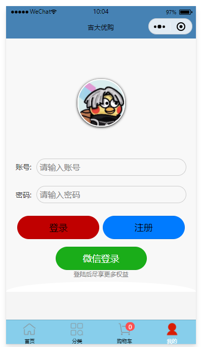

**HTML5 移动应用开发设计**

**——吉大优购项目**

| **小组成员** | **学号**     | **姓名**   |
|--------------|--------------|------------|
| **组长**     | **55221029** | **韩佩鑫** |
| **组员**     | **55221028** | **薛可敬** |
| **组员**     | **55221030** | **薛博予** |
| **组员**     | **55221018** | **韩铁锁** |

#  一、分析说明

## 1.1软件需求的分析模型

### 1.1.1发布商品的用例说明

| 用例名   | 发布各种商品或二手产品                                       |
| -------- | ------------------------------------------------------------ |
| 用例描述 | 商户根据自己的不同类型的产品发布产品信息                     |
| 参与者   | 各个商户、系统管理员                                         |
| 过程     | 1. 商户根据自己的产品编写如实的产品信息，并提交 2. 将信息表单传送到后端并存储到持久层，进行保存 3. 系统管理员从后端获取商户上传的信息，并进行审核，审核通过的允许给其他用户查询显示，不通过则通过后端通知到商户其信息不通过 4. 其他用户登录后查询商品详细信息，后端重新从持久层查询出商品详细信息并传送回前端，显示给用户 |

表1：发布商品用例描述表

### 1.1.2订单管理的用例说明

| 用例名   | 订单管理                                                     |
| -------- | ------------------------------------------------------------ |
| 用例描述 | 商户可以对自己以往的订单交易记录进行查看，并对订单进行发货、退货等处理 |
| 参与者   | 商户                                                         |
| 过程     | 1.商户成功登录到后台 2.根据以往的订单交易记录显示所有订单，如订单金额、订单交易时间、商品的购买者、商品购买种类、商品购买数量等 3.根据数据库里所有的订单汇总并使echarts在前端显示出来，以便商户对商品销售进行分析 4.订单删除，对不重要的订单商户可以对其进行删除 |

表2：订单管理用例描述表

### 1.1.3上传资料的用例说明

| 用例名   | 上传资料                                                     |
| -------- | ------------------------------------------------------------ |
| 用例描述 | 商户可以上传自己的身份资料、以用来证明自己的身份             |
| 参与者   | 商户、管理员                                                 |
| 过程     | 1.商户登录到自己的账户 2.编辑自己的资料到表单，包括身份证、姓名、自己生产的主要产品、自己的昵称、电话、商户地址、经营证书 3.管理员对资料进行审核、审核通过的允许注册，未通过的用户不允许注册 4.注册成功后商户的可以正常使用商城的功能，正常发布产品、交易产品 |

表3：上传资料用例描述表

### 1.1.4修改个人资料的用例说明

| 用例名   | 修改个人资料                                                 |
| -------- | ------------------------------------------------------------ |
| 用例描述 | 对于有些商户的产品销售类别、地址、个人简介、密码等需要做出改变的可以对其进行修改并且需要由管理员进行审核 |
| 参与者   | 商户、管理员                                                 |
| 过程     | 1.商户通过登录进入到管理后台 2.商户点击修改个人资料按钮进行修改资料，并把表单通过后端临时保存到数据库 3.管理员对后端保存的信息进行审查，审核通过的允许显示 4.限制修改资料的次数，每年只有十次机会，每用一次少一次 |

表4：修改个人资料用例描述表

### 1.1.5删除产品的用例说明

| 用例名   | 删除产品                                                     |
| -------- | ------------------------------------------------------------ |
| 用例描述 | 商户对于已经售卖完毕的产品可以经行删除下架                   |
| 参与者   | 商户                                                         |
| 过程     | 1.商户通过登录进入到管理后台 2.商户在产品管理界面，点击想要删除的产品右边的删除按钮 3.后台检测数据库中是否存在该产品相关的信息，删除过程中对删除操作进行加锁，防止其他用户购买冲突 |

表5：删除产品用例描述表

### 1.1.6查看评价的用例说明

| 用例名   | 查看评价                                                     |
| -------- | ------------------------------------------------------------ |
| 用例描述 | 商户可以查看别人对自己卖出产品的评价                         |
| 参与者   | 商户                                                         |
| 过程     | 1.商户登录到商城系统 2.后端查出该商品的所有信息包括评价传送到前端 3.商户点击商品详细信息往下滑即可看到别的用户对该商品的评价 |

表6：查看评价用例描述表

### 1.1.7购买商品的用例说明

| 用例名   | 购买商品                                                     |
| -------- | ------------------------------------------------------------ |
| 用例描述 | 普通用户可以登录后购买商品                                   |
| 参与者   | 普通用户                                                     |
| 过程     | 1.进入商城系统 2.查找到自己想要的商品 3.根据绑定的微信号或银行卡号，输入支付密码后进行购买 |

表7：购买商品用例描述表

### 1.1.8发表评论的用例说明

| 用例名   | 发表评论                                                     |
| -------- | ------------------------------------------------------------ |
| 用例描述 | 购买商品的人可以发表对该商品的评价                           |
| 参与者   | 普通用户                                                     |
| 过程     | 1.进入商城系统 2.点击已购买的商品 3.编写评论 4.提交评论 5.后端把评论保存到数据库 |

表8：发表评论用例描述表

### 1.1.9查看订单的用例说明

| 用例名   | 查看订单                                                     |
| -------- | ------------------------------------------------------------ |
| 用例描述 | 购买商品的人可以查看自己的购买历史                           |
| 参与者   | 普通用户                                                     |
| 过程     | 1.进入商城系统 2.所有订单 3.后端查询数据库并返回所有订单 |

表9：查看订单用例描述表

### 1.1.10查看物流的用例说明

| 用例名   | 查看物流                                                     |
| -------- | ------------------------------------------------------------ |
| 用例描述 | 购买商品的人可以查看自己的还未到货的商品物流信息             |
| 参与者   | 普通用户                                                     |
| 过程     | 1.进入商城系统 2.点击正在运输中的商品 3.后端查询数据库并返回商品的物流信息 |

表10：查看物流用例描述表

### 1.1.11退货换货的用例说明

| 用例名   | 退货换货                                                     |
| -------- | ------------------------------------------------------------ |
| 用例描述 | 购买商品的人可以对不满意的商品进行退货换货                   |
| 参与者   | 普通用户                                                     |
| 过程     | 1.进入商城系统 2.与商家进行协商 3.点击退货换货并输入理由 4.完成退货换货 |

表11：退货换货用例描述表

**1.2 各类图**

### 1.2.1登录顺序图

网页浏览者可以通过如图所示的顺序进行账号登录。网页浏览者可以点击登录按钮进行登录。随后服务器会接收到浏览者的点击请求后会发送指令使其进入登录界面。网页浏览者进入登录界面后可以输入账号和密码，如果登录失败则会返回错误信息。登录成功则进入系统主界面，显示登录成功信息。

**1.2.2 典型的电商系统活动图**

如图所示,经典的电商系统就应该分为一下三种情况，未登录用户，用户(买家)，以及商家，用户通过注册登录到吉大优购系统进行商品浏览，商品下单，订单管理等，商家通过注册登录系统通过商品发布，商品管理，商品仓库管理等。

**1.2.3商家管理活动图**

# 实现内容以及技术

### 1. 服务注册与发现

**服务注册与发现**是微服务架构中的核心功能，它允许各个微服务在系统中相互找到并调用。在吉大优购销售系统中，我们采用了**Spring Cloud**作为微服务的基础框架，通过**Eureka**作为服务注册与发现的工具。Eureka Server负责管理各个微服务的注册和发现，微服务在启动时向Eureka Server注册自身的实例信息，并在运行时定期心跳以维持注册状态。客户端通过Eureka获取其他服务的实例信息，确保服务的可用性与负载均衡。

### 2. 业务逻辑层

**业务逻辑层**负责处理核心业务逻辑，协调不同的微服务以满足系统需求。在这一层，我们使用**Spring Boot**和**Spring Cloud**提供的组件来实现微服务间的调用和协调。例如：

-   **Feign**：用于声明式服务调用，使得调用其他微服务的接口变得简单。我们只需定义接口和注解，Feign会为我们生成实现类。

-   **Ribbon**：用于实现客户端负载均衡，确保请求被均匀分配到各个服务实例上，提高系统的性能和可用性。

-   **Hystrix**：提供故障隔离和容错能力。当某个微服务不可用时，Hystrix可以通过降级策略保证系统的稳定性。

对于**分布式事务处理**，Spring Boot与Spring Cloud集成的**Seata**等分布式事务管理器可用于确保跨多个微服务的事务一致性，避免数据不一致的问题。

### 3. 安全与权限控制

**安全与权限控制**是保护系统敏感数据的关键环节。在业务逻辑层，我们使用**Spring Security**实现安全认证和权限控制。Spring Security允许我们配置用户认证和授权策略，支持多种认证方式（如基于表单的认证、JWT等），并能够保护系统中的API接口，防止未授权的访问。此外，Spring Security可以与OAuth 2.0等第三方认证服务集成，增强系统的安全性。

### 4. 数据访问层

**数据访问层**在系统中扮演着连接业务逻辑和数据库的桥梁，采用**MyBatis Plus**作为强大的数据访问工具。MyBatis Plus简化了数据库操作，提高了开发效率，支持一系列CRUD操作，开发者无需手动编写SQL语句。通过注解和XML配置，可以轻松实现数据库的增删改查操作。在吉大优购系统中，我们使用MyBatis Plus进行对MySQL数据库的访问，提供高性能和可靠的数据操作能力。

### 5. 实体对象映射

**实体对象映射**通过**MyBatis Plus**实现对象关系映射（ORM），将数据库表与Java实体类进行映射。在吉大优购系统中，我们使用注解将实体类与数据库表关联，利用Mapper接口提供的CRUD方法对数据进行操作。例如，我们可以定义商品的实体类，并在Mapper接口中定义获取所有商品的方法。

### 6. 前端展示层

**前端展示层**是用户与系统交互的窗口，直接影响用户体验和系统的易用性。我们使用**Vue 3**和**Element Plus**构建用户界面，前端通过API调用后端服务，实现商品的展示和用户交互。Vue 3提供了更高效的响应式系统，支持Composition API，增强了组件的逻辑复用性。

### 7. 组件化开发

借助**Vue**的组件化开发思想，前端界面得以实现模块化。这种开发方式提高了代码的可复用性和维护性，允许我们将不同功能的界面划分为不同的组件。通过组合这些组件，可以构建复杂的用户界面，满足不同的业务需求。

### 8. 使用Element Plus组件

**Element Plus**是一套基于Element UI的组件库，提供丰富的UI组件来构建美观且功能强大的界面。我们利用Element Plus的各种组件（如表格、表单、对话框等）来快速构建用户界面，增强用户体验。Element Plus还支持主题定制和国际化，使得界面更加灵活。

### 9. 路由和导航

通过**Vue Router**，我们实现前端应用的单页应用（SPA）路由管理。Vue Router允许我们定义不同的路由来控制不同页面的展示，增强用户体验。同时，我们结合Element Plus的导航菜单，实现用户导航和页面切换，提供流畅的交互体验。

### 10. 技术栈

#### 前端技术

**Vue 2 / Vue 3**：构建用户界面，管理组件状态。

**Vite**：快速构建和热重载开发工具。

**Pinia**：状态管理库，替代Vuex，提升状态管理的简洁性。

**Uniapp**：支持跨平台开发的框架，用于构建小程序和移动应用。

**Element Plus**：UI组件库，构建美观且功能强大的界面。

#### 后端技术

**Spring Boot**：构建独立的、生产级的应用。

**Spring MVC**：处理HTTP请求，提供RESTful API。

**Spring Security**：实现安全认证和权限控制。

**Spring Cache**：缓存管理，提高系统性能。

**Lombok**：减少Java样板代码，简化开发。

**WebSocket：**实现实时双向通信。

#### 数据库和持久化

**MySQL：**关系型数据库，用于存储系统数据。

**Redis：**内存数据库，用于缓存和会话管理。

**MyBatis：**持久层框架，简化数据库操作。

#### 身份验证

J**WT：用于用户身份验证和信息传递的令牌机制。**

#### 操作系统与工具

**Rocky Linux**：稳定的服务器操作系统，承载后端服务。

**Docker**：容器化技术，简化应用部署与管理。

**Tinkle Java For MySQL**：用于MySQL的Java客户端。

**FileZilla Client**：文件传输客户端，用于上传和下载文件。

**NatApp内网穿透**：实现内网服务的外部访问。

**MobaXterm Portable**：多功能远程连接工具。

**IntelliJ IDEA**：Java开发环境，提高开发效率。

**VMware**：虚拟机管理工具，支持多种操作系统的开发与测试。

#### 微信开发

**微信开发者平台：**开发和管理小程序。

**微信云开发：**后端云服务，简化后端逻辑。

**HBuilderX：**高效的跨平台开发工具。

**Redis Desktop Manager：**图形化管理Redis的客户端工具。

# 三、项目展示

## 4.1 前端展示

### 信息管理页面

#### 登录界面：

#### 注册界面：

#### 首页(轮播图，Catitems，楼层图)：

#### 分类页：

#### 商品列表页：

### 4.1.2 商品展示和搜索

#### 商品详情界面：

图片可以点击查看和滑动

#### 商品搜索界面：

### 4.1.3 下单和支付

购物车：

购物车可以进行删除操作  

微信支付：

### 4.1.4 个人界面

## 4.2 后端展示

#### 登录界面：

#### 首页：

#### 用户管理：

#### 添加用户：

#### 菜单管理：

#### 角色管理：

#### 数据库表结构：

